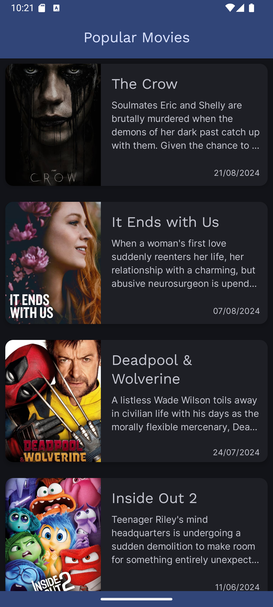
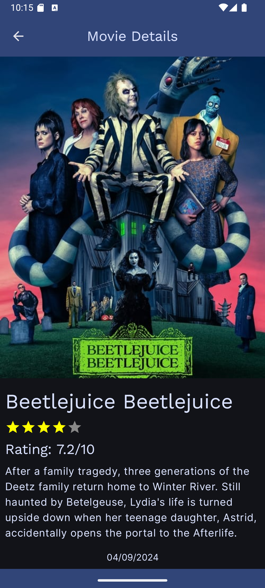

# Movie Database App

## Overview

The Movie Database App is an Android application built using Kotlin and Jetpack Compose. The app
fetches popular movie data from [The Movie Database API (TMDb)](https://www.themoviedb.org/). Users
can browse popular movies, see details like release dates, overviews, and ratings, and navigate
between different screens in the app.

### Features

- **MVVM Architecture**: The app follows MVVM for separation of concerns.
- **Paging**: Load more movies as you scroll.
- **Error Handling**: Display error messages if there's an issue with the API.
- **Loading Indicators**: Show a loading spinner while fetching data.
- **Rating System**: Display movie ratings with stars (out of 5).
- **Navigation**: Navigate between the movie list and detailed info screen.
- **Theming**: Custom app theme.

## How to Build and Run the App

### Prerequisites

- **Android Studio**
- **API Key**
  from [The Movie Database (TMDb)](https://developer.themoviedb.org/docs/getting-started)

### API Configuration

1. **Create an `api.properties` file** at the root of your project.
2. **Add the following properties** to the `api.properties` file:

   ```bash
   API_KEY=your_api_key_here
   BASE_URL=https://api.themoviedb.org/3/
   POPULAR_MOVIES_QUERY=discover/movie?include_adult=false&include_video=false&language=en-US&page=1&sort_by=popularity.desc
   MOVIE_DETAILS_QUERY=movie/{movieId}
   ```

3. **Replace `your_api_key_here`** with your TMDb API key.

### Build and Run

1. **Clone the repository**:

   ```bash
   git clone https://github.com/matiasdni/MovieDB
   ```

2. **Open the project in Android Studio**.
3. **Make sure your `api.properties` file is properly configured**
4. **Sync the project with Gradle files**.
5. **Run the app** on an emulator or physical device.

## Screenshots

### Movie List



### Movie Details


